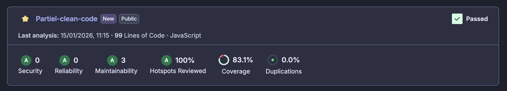

# Partiel-clean-code Ecommerce Pricing

url projet git : https://github.com/eduardo-mtr47/Partiel-clean-code
## Initialisation du projet
```bash
cd ecommerce-pricing
npm install
```
## affichage de la facture 
```bash
node index.js
```
## lancer les tests
```bash
npm test
```
## coverage des tests 
```bash
npm test -- --coverage
```

## Points manquantes

Le sujet demande 4 remises :

- Fidélité	Fait✅
- Pourcentage	 Pas fait❌
- Montant Pas fait ❌
- 3 pour 2	Pas fait ❌

## Certaines explications 

Pour essayer de faire le plus de choses demander j'ai fait uniquement 1 seul remises , pour le ci-sonar.yml j'ai repris celui que j'ai fait dans votre cours et celui que vous avez envoyé par mail .

## Photo Sonar-cloud


